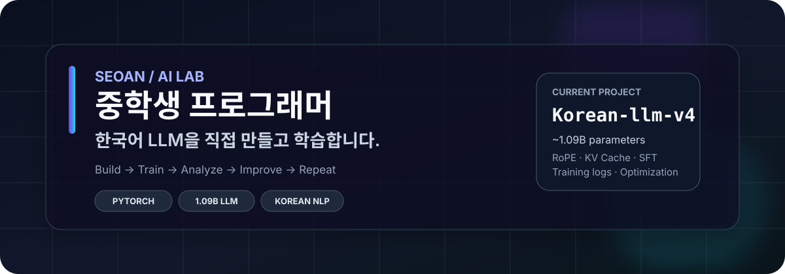
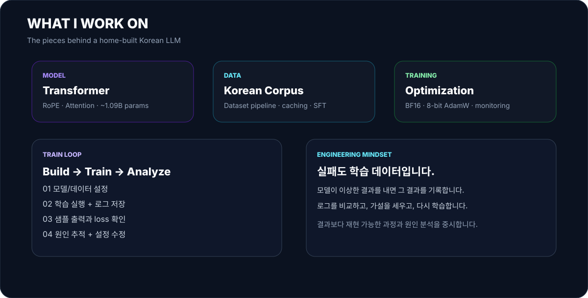
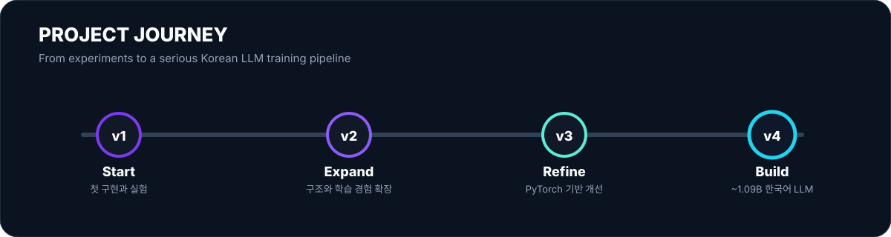
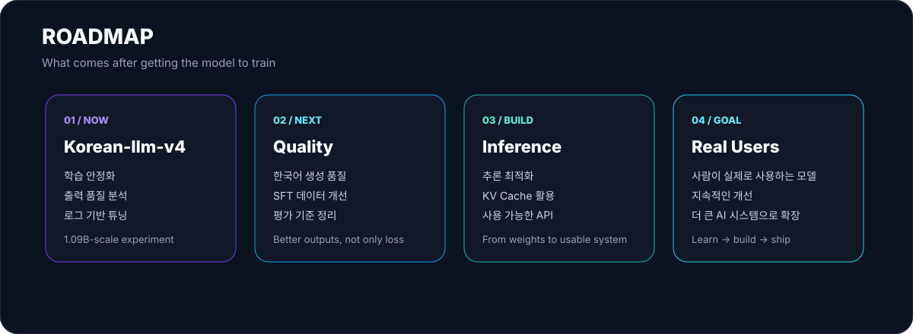
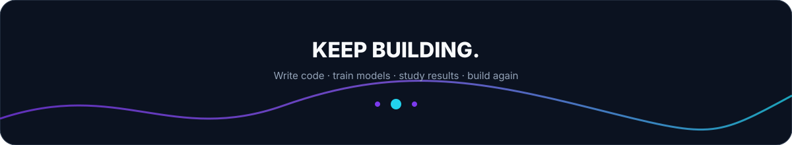

<div align="center">
  
</div>

<br />

<div align="center">
  <a href="https://github.com/seoan1024">
    
  </a>
  
  
  
</div>

<p align="center">
  <strong>중학생 프로그래머 · AI 개발자 · 한국어 LLM 제작자</strong><br />
  코드를 쓰는 것에서 끝내지 않고, 모델을 직접 만들고 학습시키며 원인을 추적합니다.
</p>

---

## 👋 안녕하세요, 서안입니다.

저는 **AI가 어떻게 만들어지는지 직접 이해하고 구현하는 것**을 좋아하는 중학생 프로그래머입니다.

특히 **한국어 LLM**을 만드는 데 관심이 많아서, 모델 구조를 코드로 구현하고 데이터를 준비하고 학습을 돌리면서 결과를 분석하는 프로젝트를 계속 확장하고 있습니다.

저에게 개발은 완성된 답을 가져오는 일이 아니라,

```text
아이디어
  ↓
코드로 구현
  ↓
실제로 실행
  ↓
이상한 결과 발견
  ↓
로그 / 데이터 / 코드 분석
  ↓
가설 세우기
  ↓
수정하고 다시 학습
  ↺
```

이 과정을 반복하면서 **"왜 이렇게 됐는가?"**를 알아가는 일에 가깝습니다. 🧠

> **Build → Train → Analyze → Improve → Repeat**

---

## 🇰🇷 My Main Project

### [Korean-llm-v4](https://github.com/seoan1024/Korean-llm-v4)

**약 1.09B 파라미터 규모의 한국어 LLM**을 직접 개발하고 학습시키는 프로젝트입니다.

단순히 모델을 불러와 사용하는 프로젝트가 아니라, **모델과 학습 파이프라인 자체를 이해하고 개선하는 것**을 목표로 하고 있습니다.

<div align="center">
  
</div>

### 🔬 현재 다루는 영역

| 영역 | 내용 |
|:--|:--|
| 🧠 Model | Transformer 기반 언어 모델 |
| 📐 Position | RoPE |
| ⚡ Inference | KV Cache |
| 🎓 Training | 한국어 사전학습 + SFT |
| 🧮 Optimization | BF16, 8-bit AdamW |
| 💾 Data | 데이터셋 캐싱 및 학습 파이프라인 |
| 📊 Monitoring | 학습 로그 저장 및 결과 비교 |

---

## 🧪 최근의 실제 실험

모델을 학습시키다 보면 항상 멋진 결과만 나오지는 않습니다.

최근에는 **학습 중 모델이 시스템 프롬프트를 반복해서 출력하는 문제**를 직접 경험했고, 설정을 되돌리고 기존 체크포인트를 정리한 뒤 다시 학습하면서 원인을 추적하고 있습니다.

현재는 **50,000 step 규모의 학습을 목표로 다시 진행하면서**, 중간 결과를 저장하고 특정 구간의 출력과 로그를 비교하는 방식으로 실험하고 있습니다.

저는 이런 과정도 프로젝트의 중요한 일부라고 생각합니다.

> **실패한 학습도 데이터입니다.**
>
> 결과가 이상하다면 실패를 지우는 것보다, 왜 실패했는지 기록하는 쪽을 선택합니다.

---

## 🚀 Project Journey

<div align="center">
  
</div>

### 📌 Repository History

- **Korean-llm-v1**  : 첫 한국어 LLM 프로젝트
- **Korean-llm-v2**  : 구현과 실험 확장
- **Korean-llm-v3**  : PyTorch 기반 개선
- **Korean-llm-v4**  : 약 1.09B 규모로 확장한 현재 메인 프로젝트

각 버전은 단순한 새 폴더가 아니라, 이전 버전에서 생긴 문제와 배운 점을 다음 버전으로 가져가는 **실험 기록의 연속**입니다.

---

## 🛠️ Tech Stack

### AI / Machine Learning

<p>
  
  
  
  
</p>

### Development

<p>
  
  
  
  
</p>

> 사용하는 도구는 계속 바뀌고 있습니다. 중요한 건 도구의 개수보다 **직접 이해하고 사용할 수 있는가**라고 생각합니다.

---

## 🧠 How I Learn AI

저는 AI를 배울 때 **설명만 읽기보다 직접 구현하고 결과를 관찰하는 방식**을 선호합니다.

예를 들어 어떤 설정이 모델에 영향을 주는지 궁금하면,

1. 현재 설정으로 학습합니다.
2. 로그와 생성 결과를 저장합니다.
3. 하나의 변수만 바꿉니다.
4. 다시 학습합니다.
5. 두 실험을 비교합니다.
6. 차이가 왜 생겼는지 가설을 세웁니다.

이렇게 작은 실험을 쌓아가면서 모델을 이해하려고 합니다.

### 🔍 특히 관심 있는 질문

```text
• 모델 크기가 커지면 한국어 생성 품질은 어떻게 달라질까?
• 학습 초반과 후반의 출력은 무엇이 달라질까?
• 데이터의 구성이 모델의 말투와 지식에 어떤 영향을 줄까?
• 학습이 잘 되고 있는지 loss 이외에 어떻게 판단할 수 있을까?
• 추론 속도와 메모리 사용량을 어떻게 줄일 수 있을까?
```

---

## 📚 내가 중요하게 생각하는 것

### 01. 직접 만들기

개념을 배우는 가장 좋은 방법 중 하나는 직접 작은 버전을 만드는 것이라고 생각합니다.

### 02. 로그 남기기

나중에 비교할 수 없는 실험은 다시 배울 수 없는 실험이 됩니다. 그래서 학습 과정과 결과를 계속 기록하려고 합니다.

### 03. 실패 분석하기

모델의 이상한 출력이나 실패한 실험도 버리지 않고 원인을 추적합니다.

### 04. 한 단계씩 개선하기

처음부터 완벽한 시스템을 만들기보다, 지금 되는 것을 기준으로 다음 문제를 해결합니다.

---

## 🗺️ Roadmap

<div align="center">
  
</div>

### 🎯 현재 목표

**Korean-llm-v4를 실제로 사용할 수 있는 한국어 모델에 최대한 가깝게 발전시키는 것**입니다.

그 다음에는 모델 자체뿐 아니라 **추론, 평가, 서비스화까지 포함한 AI 시스템 전체**를 직접 다뤄보고 싶습니다.

---

## 💻 What I'm Building

```text
                 ┌───────────────────────┐
                 │     Korean LLM        │
                 │       Korean-llm-v4   │
                 └──────────┬────────────┘
                            │
          ┌─────────────────┼─────────────────┐
          │                 │                 │
          ▼                 ▼                 ▼
     Model / Arch        Data Pipeline      Training
      Transformer         Korean Data       Pretraining
      RoPE                Caching            SFT
      Attention           Processing         Optimization
          │                 │                 │
          └─────────────────┼─────────────────┘
                            ▼
                     Logs & Evaluation
                            │
                            ▼
                        Improvement
                            │
                            └──────↺
```

이 구조 전체를 하나씩 이해해보는 것이 지금의 가장 큰 공부입니다.

---

## 📊 GitHub Activity

<div align="center">
  
  
</div>

<br />

<div align="center">
  
</div>

---

## 🏆 Highlights

<div align="center">

| 🚀 | Highlight |
|:--:|:--|
| 🧠 | 약 1.09B 파라미터 한국어 LLM 개발 |
| 🔥 | PyTorch 기반 학습 파이프라인 구축 |
| 🇰🇷 | 한국어 데이터와 생성 품질에 집중 |
| ⚡ | RoPE / KV Cache / 학습 최적화 실험 |
| 📈 | 장시간 학습과 중간 결과 모니터링 |
| 🧪 | 실패한 실험까지 기록하고 분석 |

</div>

---

## 🌱 Beyond the Current Model

지금은 한국어 LLM 하나를 만드는 데 집중하고 있지만, 최종 목표는 특정 모델 하나에 머무르지 않습니다.

**모델의 구조를 이해하고, 데이터를 다루고, 학습을 설계하고, 추론 시스템을 만들고, 실제 사용자가 쓸 수 있는 AI 서비스까지 연결하는 개발자**가 되고 싶습니다.

```text
Model
  ↓
Training
  ↓
Evaluation
  ↓
Inference
  ↓
Service
  ↓
Real Users
```

한 단계씩 올라가면서 직접 만들어보겠습니다. 🚀

---

## 📎 Featured Repositories

### 🧠 [Korean-llm-v4](https://github.com/seoan1024/Korean-llm-v4)
> 현재 메인 프로젝트. 약 1.09B 규모의 한국어 LLM을 개발하고 학습합니다.

### 🤖 [Korean-llm-v3](https://github.com/seoan1024/Korean-llm-v3)
> PyTorch 기반 한국어 LLM 구현 및 학습 프로젝트.

### 🧪 [korean-llm-v2](https://github.com/seoan1024/korean-llm-v2)
> 초기 구현과 학습 실험을 확장한 프로젝트.

### 🌱 [korean-llm-v1](https://github.com/seoan1024/korean-llm-v1)
> 한국어 LLM 프로젝트의 시작점.

---

## 📬 Contact / GitHub

<div align="center">
  <a href="https://github.com/seoan1024">
    
  </a>
</div>

<br />

<div align="center">
  
</div>

<p align="center">
  <sub>Made with Python, curiosity, and a lot of training logs.</sub>
</p>
