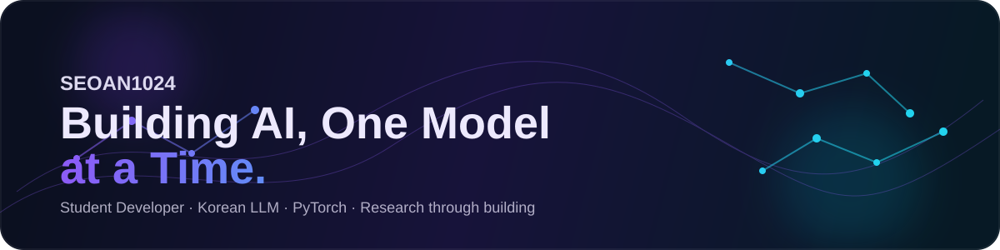

<div align="center">
  
</div>

<br />

<div align="center">
  <a href="https://github.com/seoan1024">
    
  </a>
  
  
</div>

<br />

# 👋 안녕하세요, 서안입니다.

### `중학생 프로그래머 · AI 개발자 · 한국어 LLM 제작자`

저는 **AI가 어떻게 만들어지는지 직접 이해하고 구현하는 것**을 좋아합니다.

사용하는 것에서 멈추지 않고, 모델 구조를 만들고 데이터를 준비하고 학습시키면서
**실패하고 분석하고 다시 개선하는 과정**을 즐기고 있습니다. 🧠⚡

> **Build → Train → Analyze → Improve → Repeat**

---

## 🧠 지금 만들고 있는 것

<div align="center">

### 🇰🇷 Korean-llm-v4

**1.09B Parameter Korean LLM**

</div>

PyTorch 기반으로 직접 개발하고 있는 한국어 LLM 프로젝트입니다.

```text
Model
 ├─ Transformer Architecture
 ├─ RoPE
 ├─ KV Cache
 └─ ~1.09B Parameters

Training
 ├─ Korean Pretraining
 ├─ SFT
 ├─ BF16 / 8-bit AdamW
 ├─ Dataset Caching
 └─ Training Monitoring
```

🔗 **Repository:** [Korean-llm-v4](https://github.com/seoan1024/Korean-llm-v4)

---

## 🚀 Projects

| Project | Description | Status |
|:--|:--|:--:|
| 🧠 **Korean-llm-v4** | 1.09B 한국어 LLM 개발 및 학습 | 🚧 Active |
| 🤖 **Korean-llm-v3** | PyTorch 기반 한국어 LLM | ✅ Done |
| 🧪 **Korean-llm-v2** | 한국어 LLM 구현 및 실험 | ✅ Done |
| 🌱 **Korean-llm-v1** | 첫 한국어 LLM 프로젝트 | ✅ Done |

---

## 🛠️ Tech Stack

### AI / Machine Learning

<p>
  
  
  
  
</p>

### Development

<p>
  
  
  
  
  
</p>

---

## 🔬 How I Learn

저는 정답만 찾는 것보다 **왜 그런 결과가 나왔는지 추적하는 것**을 중요하게 생각합니다.

```text
문제 발생
   ↓
로그 확인
   ↓
원인 가설
   ↓
코드 / 데이터 / 학습 설정 수정
   ↓
다시 학습
   ↓
결과 비교
   ↓
새로운 문제 발견
   ↺
```

모델이 이상하게 나오면 그것도 기록입니다.
좋은 결과만 남기는 것보다 **과정 전체를 남기는 개발자**가 되고 싶습니다.

---

## 🎯 Goal

> **직접 만든 한국어 LLM을 사람들이 실제로 사용할 수 있는 수준까지 발전시키는 것.**

그리고 언젠가는 모델 하나를 만드는 것을 넘어,
**AI 시스템 전체를 설계하고 이해할 수 있는 개발자**가 되는 것이 목표입니다.

---

## 📊 GitHub

<div align="center">
  
  
</div>

<br />

<div align="center">
  
</div>

---

<div align="center">

### 💡 Keep Building.

**Write code. Train models. Study the results. Build again.**


</div>
