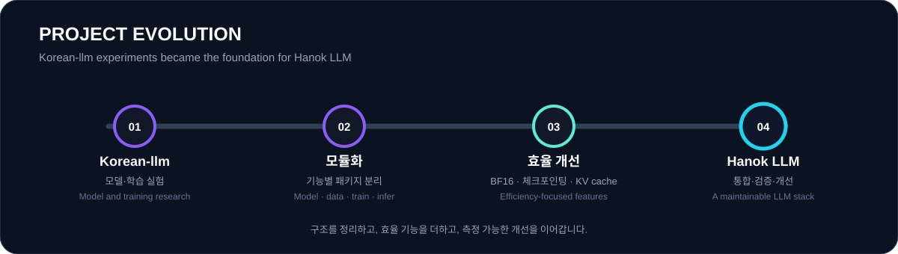
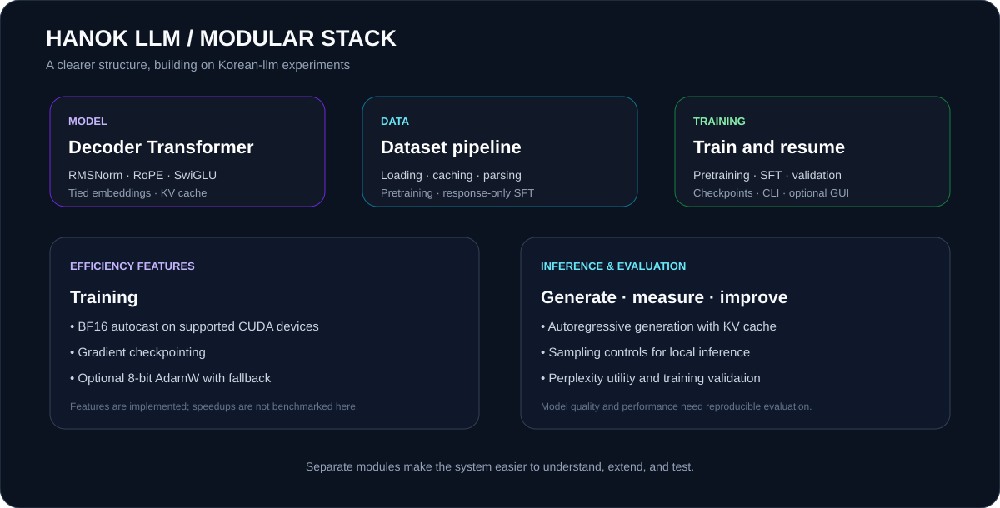
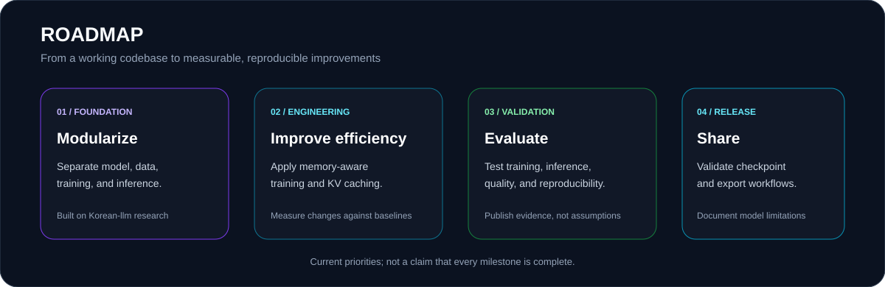
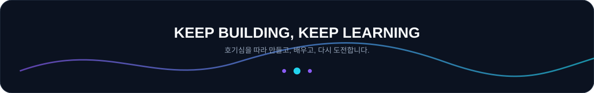

  

  <h2>안녕하세요, 서안입니다 👋</h2>

  

    직접 만들고, 궁금한 것을 실험하고, 하나씩 개선하는 과정을 좋아합니다. 
    요즘은 AI와 한국어 언어 모델을 공부하고 있습니다.
  

  

    
    
    
  

  

    
    
    
    
  

---

## 🙋 저를 소개합니다

- 코드를 직접 쓰고 실행하면서 배우는 것을 좋아합니다.
- Python, 알고리즘, 데이터 분석, 머신러닝을 공부했고 지금은 C 언어도 배우고 있습니다.
- AI가 어떻게 동작하는지 궁금해 모델 구조와 학습 과정을 살펴봅니다.
- 완벽한 첫 시도보다, 작은 결과를 확인하고 꾸준히 개선하는 것을 중요하게 생각합니다.

  
<strong>English</strong>

   
  <ul>
    <li>I like learning by writing and running code myself.</li>
    <li>I've studied Python, algorithms, data analysis, and machine learning, and I'm currently learning C.</li>
    <li>I'm curious about how AI works, so I explore model architectures and training.</li>
    <li>I value steady improvement and learning from each attempt.</li>
  </ul>

## 🧪 LLM 개발 기록

  

제가 만드는 모델은 처음부터 아키텍처를 계속 갈아엎는 방식보다는, **하나의 계열을 유지하면서 규모와 학습 시스템을 단계적으로 확장하고 검증하는 방식**으로 발전해 왔습니다.

  

### 📈 주요 실험과 버전

| 단계 | 규모 | 기록 |
| --- | ---: | --- |
| **50M** | 50M | Wikipedia 프리트레이닝에서 적은 학습량만으로도 모델이 문법을 지키기 시작하는 현상을 관찰 |
| **V1** | 541M | 데이터셋 일부가 무시되는 버그로 인해 출력이 차원적으로 무너지는 듯한 이상 증상을 확인 |
| **V2** | 1.09B | 데이터셋 무시 버그가 확인되어 해당 학습 결과를 폐기하고 다시 검증 |
| **V3** | 1.09B 계열 | 학습 메모리를 약 **23GB에서 10GB 이하**로 낮춰 학습하는 데 성공 |
| **V4** | 1.09B | 프리트레이닝과 강화 단계를 이어서 진행 |
| **Hanok** | 최종 | 학습·추론·검증을 정리하고 최종적으로 **Ollama 배포**를 준비 중 |

> V1과 V2의 핵심 문제는 모델 아키텍처를 갈아엎어야 하는 문제가 아니라 **데이터셋 처리 과정에서 일부 데이터가 무시되는 문제**였습니다.  
> 그래서 학습 결과를 억지로 살리기보다 신뢰할 수 없는 결과는 폐기하고 파이프라인을 다시 확인하는 방향을 선택했습니다.

  
<strong>English</strong>

   
  

    My LLM work has evolved by keeping the same architectural family while scaling the model and improving the training system step by step.
  

  <ul>
    <li><strong>50M:</strong> Observed grammatical consistency emerging from relatively small amounts of Wikipedia pretraining.</li>
    <li><strong>V1 / 541M:</strong> Found a dataset-skipping bug that caused severe output anomalies.</li>
    <li><strong>V2 / 1.09B:</strong> Discarded the training result after confirming the same dataset-processing issue.</li>
    <li><strong>V3:</strong> Reduced training memory usage from about 23GB to below 10GB.</li>
    <li><strong>V4:</strong> Continued with pretraining and a reinforcement stage.</li>
    <li><strong>Hanok:</strong> Preparing the final model for deployment with Ollama.</li>
  </ul>
  

    The discarded runs were caused by dataset-processing problems, not by replacing the model architecture.
  

## 🧠 배우는 방식

  
  
  
  

예상과 다른 결과가 나와도 원인을 찾아 다음 시도에 반영하려고 합니다. 작은 실험과 실패에서도 배울 점을 찾는 것이 제가 좋아하는 공부 방식입니다.

  
<strong>English</strong>

   
  I try to understand unexpected results and use what I learn in my next attempt. Small experiments—even the failed ones—are part of how I learn.

## 🔎 요즘 관심 있는 것

  
  
  
  

- 한국어 문장을 이해하고 만들어 내는 언어 모델
- 모델이 학습하는 방식과 데이터가 결과에 미치는 영향
- 코드를 읽기 쉽고 고치기 쉽게 정리하는 방법
- 실험 결과를 비교하고 실제로 나아졌는지 확인하는 방법

  
<strong>English</strong>

   
  <ul>
    <li>Language models that understand and generate Korean</li>
    <li>How models learn and how data shapes their outputs</li>
    <li>Making code easier to understand and improve</li>
    <li>Comparing experiments to see whether a change really helped</li>
  </ul>

## 🏗️ Hanok LLM 구조

  

Hanok LLM은 **모델, 데이터, 학습, 추론을 나누어 관리할 수 있는 구조**를 중심으로 발전시키고 있습니다.  
같은 모델 계열을 유지하면서도 학습 메모리와 실행 흐름을 개선하고, 실험 결과를 비교할 수 있도록 만드는 것이 목표입니다.

- Decoder Transformer 기반 모델
- RMSNorm · RoPE · SwiGLU
- Tied embeddings · KV cache
- Pretraining · SFT · validation
- Checkpoint · CLI · 선택적 GUI
- BF16 autocast · Gradient checkpointing · 선택적 8-bit AdamW

  
<strong>English</strong>

   
  Hanok LLM is organized around a modular stack for model, data, training, and inference. I focus on improving memory efficiency and reproducibility while keeping the same model family and validating each change through experiments.

## 🚀 요즘 만들고 있는 것

  
  

기존 **Korean-llm**을 모듈화하고 학습·추론 과정을 개선한 **[Hanok LLM](https://github.com/seoan1024/Hanok-LLM)**을 만들며 배우고 있습니다. 프로젝트 설명은 [저장소에서 확인할 수 있습니다](https://github.com/seoan1024/Hanok-LLM).

  
<strong>English</strong>

   
  I'm learning by building **[Hanok LLM](https://github.com/seoan1024/Hanok-LLM)**, a more modular continuation of my Korean-llm work with improvements to the training and inference workflow. See the repository for project details.

## 🗺️ 앞으로의 방향

  

현재 Hanok LLM의 다음 목표는 **학습 결과를 실제로 검증하고, 재현 가능한 형태로 정리한 뒤 배포하는 것**입니다.

- 최종 프리트레이닝 및 강화 단계 마무리
- 학습 결과 검증과 비교 실험
- 모델과 데이터 파이프라인 정리
- Ollama 배포
- 이후 더 넓은 언어 지원과 멀티모달·도구 사용 연구로 확장

  
<strong>English</strong>

   
  My next goals are to finish the final training stages, validate the results with reproducible experiments, organize the model and data pipeline, and release Hanok through Ollama. Future work may expand toward multilingual, multimodal, and tool-using systems.

## 🛠️ 요즘 사용하는 도구

  
  
  
  

  

